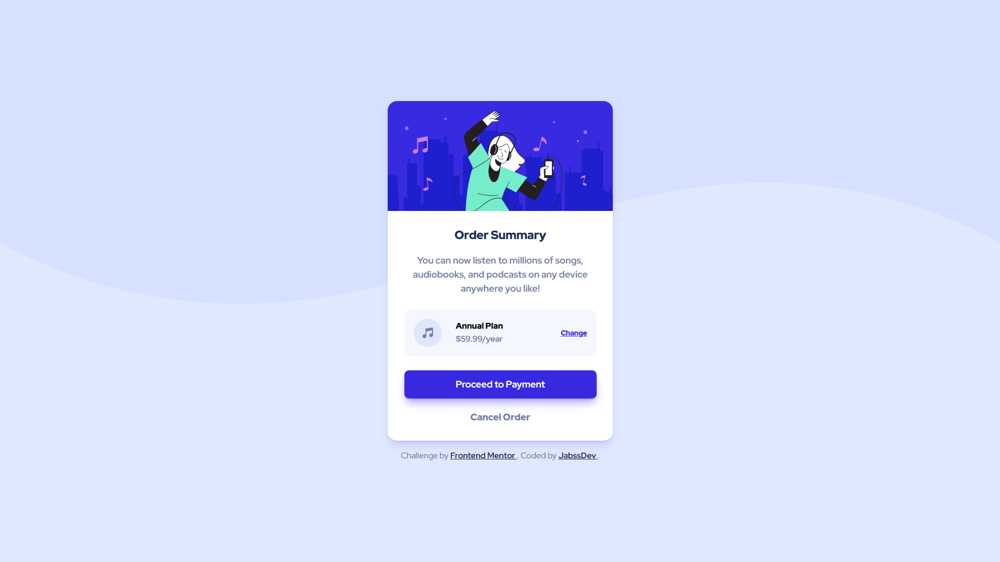

# Frontend Mentor - Order summary card solution

This is a solution to the [Order summary card challenge on Frontend Mentor](https://www.frontendmentor.io/challenges/order-summary-component-QlPmajDUj). Frontend Mentor challenges help you improve your coding skills by building realistic projects.

## Table of contents

- [Overview](#overview)
  - [The challenge](#the-challenge)
  - [Screenshot](#screenshot)
  - [Links](#links)
- [My process](#my-process)
  - [Built with](#built-with)
  - [What I learned](#what-i-learned)
  - [Continued development](#continued-development)
  - [Useful resources](#useful-resources)
- [Author](#author)

## Overview

### The challenge

Users should be able to:

- View the optimal layout depending on their device's screen size
- See hover and focus states for all interactive elements on the page

### Screenshot



### Links

- Solution URL: [GitHub Repository](https://github.com/jabssdev/order-summary-component)
- Live Site URL: [Live Demo](https://order-summary-component-jabssdev.netlify.app/)

## My process

### Built with

- Semantic HTML5 markup
- Tailwind CSS v4 - Utility-first CSS framework
- Flexbox for layout
- Mobile-first workflow
- Webpack 5 - Module bundler
- PostCSS - CSS processing with @tailwindcss/postcss
- html-loader - For processing HTML templates
- MiniCssExtractPlugin - For CSS extraction
- CssMinimizerPlugin - For CSS optimization
- Webpack Dev Server - For local development with hot reload
- Prettier - Code formatting with Tailwind plugin

### What I learned

Through this project, I strengthened my understanding of several key concepts:

**1. Migrating to Tailwind CSS v4**

This project was my first experience with Tailwind CSS v4, which introduces significant changes from v3:

```css
@import 'tailwindcss';

@theme {
  --color-blue-50: hsl(225, 100%, 98%);
  --color-blue-100: hsl(225, 100%, 94%);
  --color-blue-700: hsl(245, 75%, 52%);
  --color-blue-950: hsl(223, 47%, 23%);
  --color-gray-600: hsl(224, 23%, 55%);

  --font-redhat: 'Red Hat Display', sans-serif;
}
```

The new v4 approach replaces `tailwind.config.js` with CSS-native `@theme` directive, making configuration more intuitive and eliminating the need for JavaScript configuration files. The `@import 'tailwindcss'` replaces the old `@tailwind` directives.

**2. Custom Font Loading with font-display: swap**

Implementing custom fonts with optimal loading strategy for better performance:

```css
@font-face {
  font-family: 'Red Hat Display';
  src: url(assets/fonts/Red_Hat_Display/static/RedHatDisplay-Medium.ttf)
    format('truetype');
  font-weight: 500;
  font-style: normal;
  font-display: swap;
}
```

Using `font-display: swap` ensures text remains visible during font loading, preventing FOIT (Flash of Invisible Text) and improving user experience and Core Web Vitals scores.

**3. Accessibility Best Practices**

Using `sr-only` class for screen reader accessible headings:

```html
<h1 class="sr-only">Order Summary</h1>
```

This keeps the proper HTML hierarchy for screen readers while hiding the H1 visually, improving accessibility without compromising the design.

**4. Modern CSS with Tailwind Utilities**

Combining modern Tailwind utilities for responsive design:

```html
<body
  class="font-redhat flex h-dvh flex-col items-center justify-center gap-4 bg-[url('./assets/images/pattern-background-mobile.svg')] bg-cover bg-top bg-no-repeat p-5 md:bg-[url('./assets/images/pattern-background-desktop.svg')] md:bg-contain"
></body>
```

Using arbitrary values with `bg-[url()]` and the `dvh` (dynamic viewport height) unit for better mobile browser compatibility.

### Continued development

In future projects, I want to continue focusing on:

- **Tailwind CSS v4 Advanced Features**: Exploring CSS-native configuration, custom variants, and advanced theming with CSS variables
- **Performance Optimization**: Implementing lazy loading for images, analyzing Core Web Vitals, and optimizing bundle sizes with code splitting
- **Advanced Webpack Configuration**: Tree shaking, dynamic imports, and bundle analysis for better performance metrics
- **Accessibility Testing**: Using automated tools like axe DevTools and manual testing with screen readers (NVDA, JAWS)
- **CSS Container Queries**: Exploring component-level responsive design for more modular and reusable components
- **TypeScript Integration**: Adding type safety to JavaScript for better maintainability in larger projects
- **Modern CSS Features**: Deepening knowledge of CSS Grid, logical properties, and modern layout techniques
- **Progressive Enhancement**: Building resilient interfaces that work without JavaScript and enhance progressively

### Useful resources

- [Tailwind CSS v4 Documentation](https://tailwindcss.com/docs) - Essential guide for understanding the new v4 syntax and @theme directive.
- [Tailwind CSS v4 Migration Guide](https://tailwindcss.com/docs/upgrade-guide) - Helpful resource for transitioning from v3 to v4.
- [Webpack Documentation](https://webpack.js.org/concepts/) - Essential for understanding module bundling, loaders, and plugins configuration.
- [Webpack Asset Modules](https://webpack.js.org/guides/asset-modules/) - Documentation for handling images and fonts with Webpack 5's built-in Asset Modules.
- [web.dev: Font Best Practices](https://web.dev/font-best-practices/) - Best practices for loading custom fonts with `font-display: swap` for better performance.
- [MDN Web Docs: CSS @theme](https://developer.mozilla.org/en-US/docs/Web/CSS/@theme) - Understanding CSS-native theming in Tailwind v4.
- [A11Y Project: Visually Hidden](https://www.a11yproject.com/posts/how-to-hide-content/) - Best practices for hiding content visually while keeping it accessible to screen readers.
- [PostCSS Documentation](https://postcss.org/) - Guide for understanding CSS processing and transformations.
- [Prettier Plugin for Tailwind CSS](https://github.com/tailwindlabs/prettier-plugin-tailwindcss) - Automatic class sorting for consistent Tailwind class ordering.

## Author

- LinkedIn - [@jabssdev](https://www.linkedin.com/in/jabssdev/)
- Frontend Mentor - [@jabssdev](https://www.frontendmentor.io/profile/jabssdev)
- Instagram - [@jabssdev](https://www.instagram.com/jabssdev/)
